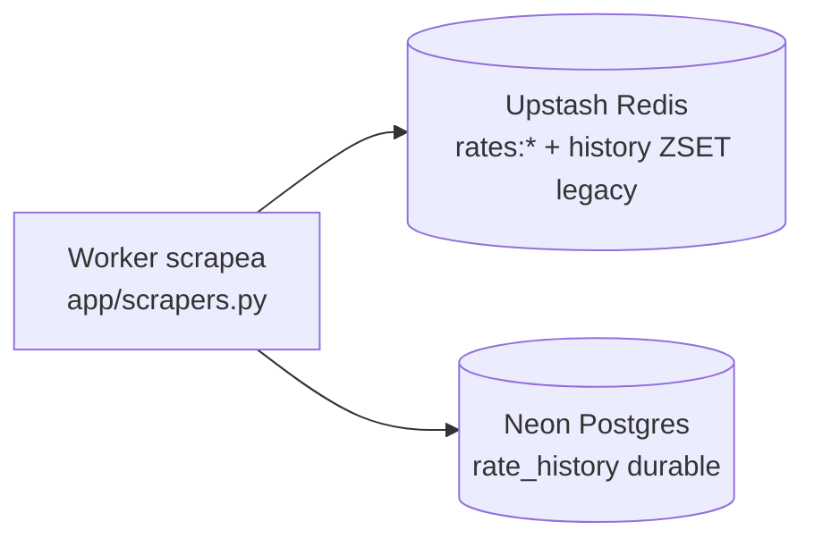
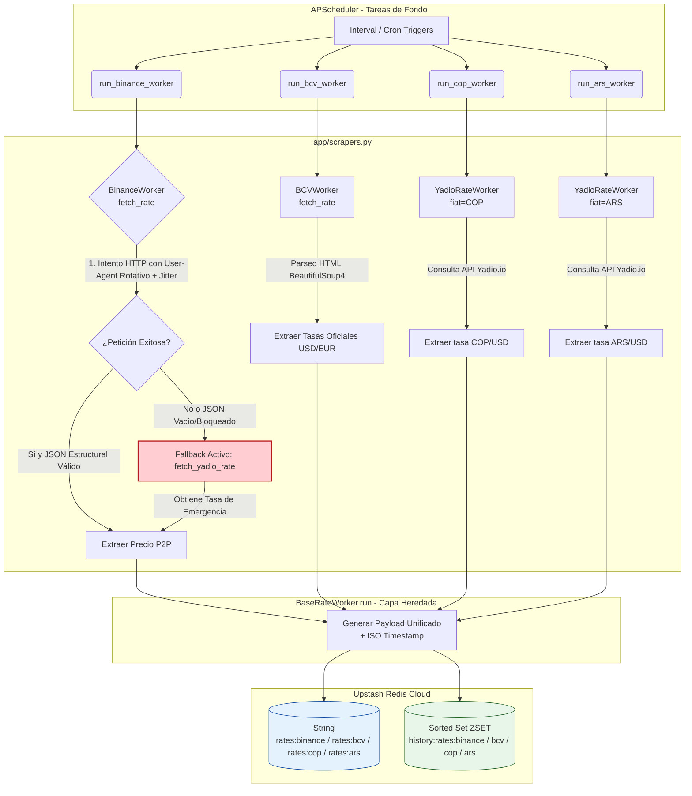
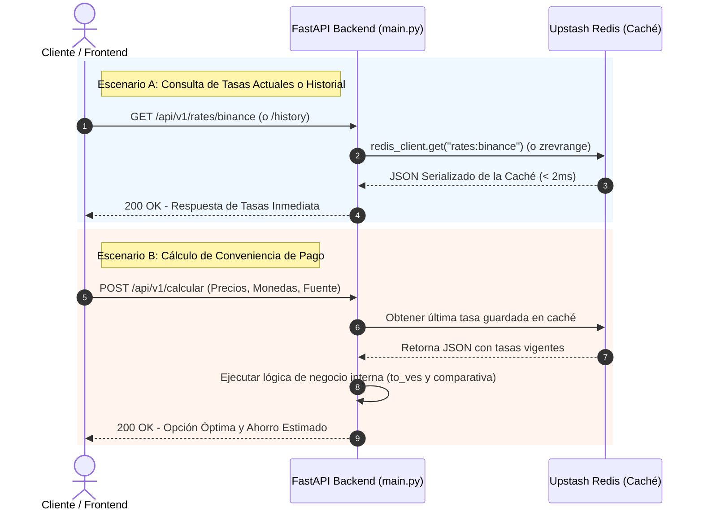
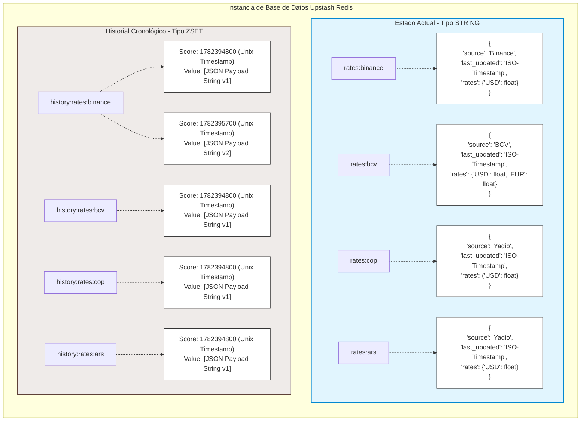

## CAMBIALY (BACKEND)

- [**API** Calculadora de Conveniencia Cambiaria (**VES**/**USD**/**EUR**)](#api-calculadora-de-conveniencia-cambiaria-vesusdeur)
- [🏗️ Arquitectura del Sistema](#-arquitectura-del-sistema)
   * [1. Infraestructura de Extracción Resiliente (Scrapers)](#1-infraestructura-de-extracción-resiliente-scrapers)
   * [2. Capa de Persistencia y Caché Avanzada (Upstash Redis)](#2-capa-de-persistencia-y-caché-avanzada-upstash-redis)
   * [3. Ciclo de Vida y Orquestación de Fondo (FastAPI Lifespan)](#3-ciclo-de-vida-y-orquestación-de-fondo-fastapi-lifespan)
- [📁 Estructura de carpetas ](#-estructura-de-carpetas)
   * [Descripción rápida de archivos clave:](#descripción-rápida-de-archivos-clave)
- [🛠️ Tecnologías Utilizadas](#-tecnologías-utilizadas)
- [🔌 Endpoints de la API (Rutas)](#-endpoints-de-la-api-rutas)
   * [**1. Estado del Sistema**](#1-estado-del-sistema)
   * [**2. Obtener Tasas del Día (BCV / Binance)**](#2-obtener-tasas-del-día-bcv-binance)
   * [**3. Obtener Historial Cronológico de Tasas**](#3-obtener-historial-cronológico-de-tasas)
   * [**4. Calcular Conveniencia de Pago**](#4-calcular-conveniencia-de-pago)
   * [**5. Diagnóstico del Programador de Tareas**](#5-diagnóstico-del-programador-de-tareas)
- [💻 Configuración Local](#-configuración-local)
   * [Método Tradicional (Entorno Virtual)](#método-tradicional-entorno-virtual)
   * [Método con Docker (Recomendado)](#método-con-docker-recomendado)
- [📊 Diagramas de la Arquitectura](#-diagramas-de-la-arquitectura)
   * [Diagrama de Estado de Datos](#diagrama-de-estado-de-datos)
   * [Diagrama de Flujo de Datos (Interacción del Usuario)](#diagrama-de-flujo-de-datos-interacción-del-usuario)
   * [Diagrama del Modelo de Datos en Redis](#diagrama-del-modelo-de-datos-en-redis)
- [Guía de Despliegue en Producción (Render + Upstash)](#guía-de-despliegue-en-producción-render-upstash)
- [❓ FAQ: Decisiones Técnicas del Proyecto](#-faq-decisiones-técnicas-del-proyecto)
   * [1. ¿Por qué se utiliza un esquema de segundo plano si es una calculadora?](#1-por-qué-se-utiliza-un-esquema-de-segundo-plano-si-es-una-calculadora)
   * [2. ¿Por qué utilizar Sorted Sets (ZSET) de Redis en lugar de una base de datos relacional (PostgreSQL) para el historial?](#2-por-qué-utilizar-sorted-sets-zset-de-redis-en-lugar-de-una-base-de-datos-relacional-postgresql-para-el-historial)
   * [3. ¿Qué sucede si tanto Binance como el servicio de contingencia (Yadio) fallan al mismo tiempo?](#3-qué-sucede-si-tanto-binance-como-el-servicio-de-contingencia-yadio-fallan-al-mismo-tiempo)
   * [4. ¿Por qué acoplar el Scheduler al Lifespan de FastAPI en lugar de usar un proceso independiente como Celery?](#4-por-qué-acoplar-el-scheduler-al-lifespan-de-fastapi-en-lugar-de-usar-un-proceso-independiente-como-celery)
   * [5. ¿Cómo se mitiga el envenenamiento de datos o la inserción de payloads corruptos en Redis?](#5-cómo-se-mitiga-el-envenenamiento-de-datos-o-la-inserción-de-payloads-corruptos-en-redis)
   * [6. ¿Por qué `last_updated` se guarda como timestamp Unix (float) en lugar de `TIMESTAMPTZ`?](#6-por-qué-last_updated-se-guarda-como-timestamp-unix-float-en-lugar-de-timestamptz)

<!-- TOC end -->

<!-- TOC --><a name="api-calculadora-de-conveniencia-cambiaria-vesusdeur"></a>
## **API** Calculadora de Conveniencia Cambiaria (**VES**/**USD**/**EUR**)

Este proyecto consiste en una **API REST** automatizada, asíncrona y de alta velocidad diseñada para calcular en tiempo real qué método de pago (divisas en efectivo, euros o bolívares a tasa oficial/paralela) resulta más conveniente al realizar una compra en Venezuela.

El objetivo es resolver un problema cotidiano: la pérdida de dinero por redondeos mal calculados o brechas cambiarias asimétricas entre comercios y las tasas del mercado vigente.

---

<!-- TOC --><a name="-arquitectura-del-sistema"></a>
## 🏗️ Arquitectura del Sistema

Para soportar tráfico concurrente masivo en producción sin saturar proveedores externos, evitar bloqueos de red y garantizar alta disponibilidad, el backend no consulta los portales de origen en cada petición del cliente. En su lugar, implementa un ecosistema desacoplado y tolerante a fallos:

<!-- TOC --><a name="1-infraestructura-de-extracción-resiliente-scrapers"></a>
### 1. Infraestructura de Extracción Resiliente (Scrapers)
Diseñada bajo el patrón de diseño **Template Method Pattern** mediante la clase abstracta `BaseRateWorker`. Centraliza de manera agnóstica el flujo de ejecución, control estructural de esquemas de datos, inyección de marcas de tiempo ISO y persistencia.
* **`BinanceWorker` con Automejoras de Camuflaje:** Incorpora **User-Agents rotativos** y retrasos aleatorios de **Jitter dinámico** (esperas entre 1 y 8 segundos) antes de cada petición para mitigar el rastreo automatizado de IPs.
* **Mecanismo de Failover (Plan B):** Ante cualquier anomalía crítica en el pipeline de Binance (timeouts, payloads de datos vacíos por baneo, códigos HTTP no erróneos pero restrictivos), el scraper activa un bypass transparente hacia la API de **Yadio.io** como proveedor de contingencia de alta disponibilidad, protegiendo la continuidad del servicio.
* **`YadioRateWorker` (COP / ARS):** Worker genérico parametrizable por moneda fiat (`app/scrapers.py:209`). Consulta `https://api.yadio.io/exchanges/{fiat}` en intervalos de 15 minutos. Se instancia como `YadioRateWorker(fiat="COP", redis_key="rates:cop")` y `YadioRateWorker(fiat="ARS", redis_key="rates:ars")` para alimentar las tasas de Peso Colombiano y Peso Argentino respectivamente.

<!-- TOC --><a name="2-capa-de-persistencia-y-caché-avanzada-upstash-redis"></a>
### 2. Capa de Persistencia y Caché Avanzada (Upstash Redis + Neon Postgres)
La información recolectada impacta en **dos destinos paralelos e independientes**: Redis administrado por Upstash (caché caliente) y Postgres serverless de Neon (historial durable). Esquema dual de datos:
* **Estado Actual (`String`):** Almacena un objeto JSON serializado en las llaves `rates:bcv`, `rates:binance`, `rates:cop` y `rates:ars` para proveer lecturas inmediatas (< 2ms) a la calculadora y endpoints de tasas.
* **Registro de Auditoría e Historial (`ZSET` / Sorted Set):** Guarda secuencias cronológicas bajo las llaves `history:rates:bcv`, `history:rates:binance`, `history:rates:cop` y `history:rates:ars`. El índice de ordenamiento (*score*) corresponde al timestamp Unix del evento. **Legacy:** se mantiene escribiendo durante la transición, pero la lectura ya no pasa por aquí.
* **Historial Durable (`Postgres` / Neon):** Tabla `rate_history` (`category`, `source`, `last_updated` como timestamp Unix, `rates` JSONB) con índice `(category, last_updated DESC)`. El endpoint v3 de historial lee exclusivamente de aquí.
* **Estrategia de Keep-Alive:** Una tarea programada dedicada ejecuta pings de verificación constantes en intervalos de 5 minutos hacia Upstash, previniendo la degradación de conexiones y neutralizando la latencia asociada a los arranques en frío (*cold starts*) en servicios Serverless o gratuitos.

**Flujo de escritura (dual-write):** el worker scrapea una sola vez y escribe **en paralelo** a Upstash y a Neon:



**Upstash NO alimenta a Neon** — son destinos paralelos, no un pipeline. Ambos sobreviven la caída del otro. Única excepción: `scripts/backfill.py` (one-shot manual que migra el ZSET histórico acumulado antes de la migración).

<!-- TOC --><a name="3-ciclo-de-vida-y-orquestación-de-fondo-fastapi-lifespan"></a>
### 3. Ciclo de Vida y Orquestación de Fondo (FastAPI Lifespan)
La automatización de tareas en segundo plano está gestionada mediante **APScheduler** (`AsyncIOScheduler`), el cual está completamente acoplado al administrador síncrono del contexto `lifespan` de FastAPI.
* **Hidratación de Caché en Startup:** Durante la fase de inicialización temprana del servidor (antes de recibir tráfico HTTP), la API fuerza una ejecución de carga síncrona inicial de todos los workers. Esto asegura que la base de datos de producción nunca responda con datos nulos o vacíos en frío.
* **Políticas de Tolerancia de Tareas:** Las rutinas críticas de fondo utilizan configuraciones de `misfire_grace_time=30` para asegurar que desfases temporales en la CPU del servidor no descarten ejecuciones planificadas ni saturen los sistemas de logs con advertencias innecesarias.

---

<!-- TOC --><a name="-estructura-de-carpetas"></a>
## 📁 Estructura de carpetas 

```text
ahorrave-backend/
├── app/
│   ├── __init__.py
│   ├── main.py              # Punto de entrada de la API y Lifespan de FastAPI
│   ├── schemas.py           # Modelos de Pydantic (Validación estructural estricta)
│   ├── services.py          # Lógica de negocio e integración de APIs de contingencia
│   ├── database.py          # Conexión optimizada con Upstash Redis
│   ├── scrapers.py          # Infraestructura abstracta y trabajadores (BCV / Binance)
│   └── utils.py             # Funciones auxiliares y formateadores
├── tests/                   # Suite de pruebas unitarias
├── .env                     # Configuración de variables de entorno seguras
├── docker-compose.yml       # Orquestación de infraestructura en contenedores
├── Dockerfile               # Empaquetado optimizado del entorno Python
├── requirements.txt         # Árbol de dependencias del sistema
└── README.md                # Documentación del proyecto

```

<!-- TOC --><a name="descripción-rápida-de-archivos-clave"></a>
### Descripción rápida de archivos clave:

* **`app/main.py`**: Orquesta el ciclo de vida de la aplicación (`lifespan`), expone la documentación interactiva en `/docs`, captura de forma global las excepciones y define las rutas públicas de consumo.
* **`app/scrapers.py`**: Contiene la lógica modularizada de extracción web. Implementa herencia e hilos asíncronos para aislar las complejidades de parseo de código HTML (BeautifulSoup4) y consultas seguras JSON (HTTPX).
* **`app/scheduler.py`**: Centraliza la configuración temporal de los intervalos automáticos:
* `job_ping_redis`: Intervalo regular estricto cada 5 minutos.
* `job_binance_scraper`: Intervalo regular cada 15 minutos.
* `job_bcv_scraper`: Expresión `cron` parametrizada de Lunes a Viernes, ejecutándose entre las 11:00 y las 18:00, en los minutos 0 y 30 de cada hora.
* `job_cop_scraper`: Intervalo cada 15 minutos — Worker de Peso Colombiano vía Yadio.io.
* `job_ars_scraper`: Intervalo cada 15 minutos — Worker de Peso Argentino vía Yadio.io.
* **`app/utils.py`**: Funciones auxiliares: `datetime_to_unix()` para convertir datetimes ISO8601 a timestamps Unix.
* **`app/schemas.py`**: Modelos Pydantic — `CalculationRequest`, `CalculationResponse` y `RateResponseDTO` (DTO estandarizado para respuestas de tasas V2: `source`, `target_currency`, `rate_value`, `last_updated`).
* **`tests/`**: 23 tests unitarios distribuidos en 8 archivos (`test_main.py`, `test_schemas.py`, `test_rate_limit.py`, `test_security_headers.py`, `test_exception_handler.py`, `test_debug_auth.py`, `test_services.py`).


---

<!-- TOC --><a name="-tecnologías-utilizadas"></a>
## 🛠️ Tecnologías Utilizadas

* **Framework Base:** `FastAPI` 0.100+ (Asíncrono, basado en ASGI, autogenerador de OpenAPI/Swagger).
* **Gestión de Tareas:** `APScheduler` (Advanced Python Scheduler).
* **Cliente HTTP:** `HTTPX` (Soporte nativo asíncrono concurrente).
* **Procesamiento HTML:** `BeautifulSoup4` + `lxml`.
* **Motor de Caché:** `Redis` (Conectores SSL directos a Upstash).
* **Ecosistema DevOps:** `Docker` & `Docker Compose` para estandarización de contenedores locales y entornos cloud.

---

<!-- TOC --><a name="-endpoints-de-la-api-rutas"></a>
## 🔌 Endpoints de la API (Rutas)

### V1 — Endpoints heredados

<!-- TOC --><a name="1-estado-del-sistema"></a>
#### **1. Estado del Sistema**

* **Ruta:** `GET /`
* **Descripción:** Endpoint de bienvenida y comprobación visual inmediata. Devuelve enlaces rápidos a la documentación.
* **Ruta:** `GET /health`
* **Descripción:** Health check para orquestadores en la nube (Render/AWS). Confirma la vitalidad operativa del microservicio.

<!-- TOC --><a name="2-obtener-tasas-del-día-bcv-binance"></a>
#### **2. Obtener Tasas del Día (BCV / Binance)**

* **Rutas:** `GET /api/v1/rates/bcv` | `GET /api/v1/rates/binance`
* **Descripción:** Recupera en milisegundos las tasas vigentes estructuradas directo desde la memoria RAM de Redis.
* **Respuesta de Muestra (Binance JSON):**

```json
{
  "source": "Binance",
  "last_updated": "2026-06-09T13:35:00.123456Z",
  "rates": {
    "USD": 45.20
  }
}

```

<!-- TOC --><a name="3-obtener-historial-cronológico-de-tasas"></a>
#### **3. Obtener Historial Cronológico de Tasas (V1)**

* **Ruta:** `GET /api/v1/rates/history/{category}`
* **Parámetros de Consulta:**
* `category` (Path): `bcv` o `binance` (Obligatorio).
* `limit` (Query): Entero entre 1 y 100. Controla el tamaño de la respuesta (Por defecto: 20).
* **Descripción:** Consulta el Sorted Set inverso en Redis para recuperar los cortes analíticos exactos, ordenados cronológicamente desde el más reciente al más antiguo.

<!-- TOC --><a name="4-calcular-conveniencia-de-pago"></a>
#### **4. Calcular Conveniencia de Pago**

* **Ruta:** `POST /api/v1/calcular`
* **Descripción:** Recibe las dos opciones comerciales del punto de venta, evalúa las monedas de entrada (`USD`, `VES`, `EUR`, `COP`, `ARS`), inyecta la tasa guardada de la fuente preferida y calcula la opción económicamente óptima y el ahorro real generado.
* **Cuerpo de la Petición (`CalculationRequest`):**

```json
{
  "price_a": 20.00,
  "type_a": "USD",
  "price_b": 920.00,
  "type_b": "VES",
  "target_currency": "USD",
  "preferred_source": "binance"
}

```

<!-- TOC --><a name="5-diagnóstico-del-programador-de-tareas"></a>
#### **5. Diagnóstico del Programador de Tareas**

* **Ruta:** `GET /debug/scheduler`
* **Descripción:** Endpoint seguro interno que permite auditar el estado del planificador asíncrono, mostrando los identificadores de tareas activos, referencias de funciones y la hora exacta de su próxima ejecución automatizada.

---

### V2 — Endpoints modernos (CAM-15, CAM-16, CAM-14, CAM-13, CAM-22)

Todos los endpoints V2 devuelven respuestas estandarizadas mediante `RateResponseDTO` (`{source, target_currency, rate_value, last_updated}`). El router se monta bajo el prefijo `/api/v2/rates/`.

<!-- TOC --><a name="v2-tasas-por-activo"></a>
#### **6. Tasas por Tipo de Activo** — `GET /api/v2/rates/{asset}`

| Activo | Ruta | Fuente | Redis key |
|---|---|---|---|
| USD | `/api/v2/rates/usd` | BCV | `rates:bcv` / `history:rates:bcv` |
| EUR | `/api/v2/rates/eur` | BCV | `rates:bcv` / `history:rates:bcv` |
| USDT | `/api/v2/rates/usdt` | Binance P2P | `rates:binance` / `history:rates:binance` |
| COP | `/api/v2/rates/cop` | Yadio.io | `rates:cop` / `history:rates:cop` |
| ARS | `/api/v2/rates/ars` | Yadio.io | `rates:ars` / `history:rates:ars` |

**Parámetros de Consulta:**

| Parámetro | Tipo | Requerido | Descripción |
|---|---|---|---|
| `date` | `datetime` (ISO8601) | No | **CAM-22:** Fecha/hora para consulta histórica. Ej: `2026-06-15T14:30:00Z` |

* **Sin `?date=`:** Devuelve `RateResponseDTO` con la tasa más reciente.
* **Con `?date=`:** Busca en el Sorted Set `history:rates:{source}` el registro con timestamp más cercano `<=` al indicado y retorna:

```json
{
  "currency": "USDT",
  "rate": 46.50,
  "timestamp": "2026-06-15T14:30:00Z"
}
```

* **Respuesta `RateResponseDTO` (sin fecha):**

```json
{
  "source": "Binance",
  "target_currency": "USDT",
  "rate_value": 46.50,
  "last_updated": "2026-06-15T14:30:00.123456Z"
}
```

<!-- TOC --><a name="v2-historial-paginado"></a>
#### **7. Historial Paginado con Filtro por Fechas** — `GET /api/v3/rates/history/{category}`

**Parámetros de Ruta:**

| Parámetro | Tipo | Valores |
|---|---|---|
| `category` | `string` (path) | `bcv`, `binance`, `cop`, `ars` |

**Parámetros de Consulta:**

| Parámetro | Tipo | Defecto | Descripción |
|---|---|---|---|
| `page` | `int` | 1 | **CAM-14:** Número de página (comienza en 1) |
| `size` | `int` | 50 | **CAM-14:** Registros por página (máx 100) |
| `date` | `date` (YYYY-MM-DD) | `null` | **CAM-13:** Una sola fecha → **TODAS** las tasas de ese día completo. Excluye `start_date`/`end_date`. Ej: `2026-06-01` |
| `start_date` | `date` (YYYY-MM-DD) | `null` | **CAM-13:** Filtro inicio. Solo esta fecha → **TODAS** las tasas de ese día completo. Ej: `2026-06-01` |
| `end_date` | `date` (YYYY-MM-DD) | `null` | **CAM-13:** Filtro fin. Con `start_date` forma rango inclusivo de días completos. Ej: `2026-06-03` |

**Respuesta:**

```json
{
  "category": "binance",
  "page": 1,
  "size": 50,
  "total_records": 1200,
  "history": [
    {
      "source": "Binance",
      "last_updated": "2026-06-15T14:30:00.123456Z",
      "rates": { "USD": 46.50 }
    }
  ]
}
```

**Comportamiento del filtro por fechas (CAM-13):**
* El historial se lee de **Postgres (Neon)** — tabla `rate_history` (`category`, `source`, `last_updated` unix, `rates` JSONB), índice `(category, last_updated DESC)`. Redis queda solo para la tasa actual.
* Sin `start_date` / `end_date` / `date` → cuenta total con `COUNT`, pagina con `ORDER BY last_updated DESC + OFFSET/LIMIT`.
* `date` o `start_date` solo → **día completo**: `00:00:00` a `23:59:59` de esa fecha (`WHERE last_updated BETWEEN`). Ej: `?date=2026-06-01` o `?start_date=2026-06-01` trae TODAS las tasas del 1 de junio, sin importar la hora.
* `start_date` + `end_date` → rango **inclusivo** de días completos: `start_date` desde las `00:00:00` y `end_date` hasta las `23:59:59`. Ej: `?start_date=2026-06-01&end_date=2026-06-03` trae las tasas del 1, 2 y 3 de junio.
* `date` mezclado con `start_date`/`end_date` → `400 Bad Request`.
* `end_date < start_date` → `400 Bad Request`.
* Formato inválido → `422 Unprocessable Entity`. Se tolera ISO8601 completo (`2026-06-01T00:00:00Z` se trunca a `2026-06-01`).
* Si no hay datos en el rango → `history` vacío, `total_records: 0`.
* Sin `DATABASE_URL` configurado → `503 Service Unavailable`.

---

### Seguridad y Middleware

| Componente | Descripción |
|---|---|
| **CORS** | Orígenes configurables vía `ALLOWED_ORIGINS` (env). Por defecto `localhost:5173` en desarrollo, restrictivo en producción. |
| **Rate Limiting** | slowapi — 10 solicitudes/minuto por IP. Excede el límite → `429 Too Many Requests`. |
| **Seguridad HTTP** | `X-Content-Type-Options: nosniff`, `X-Frame-Options: DENY`, `Strict-Transport-Security: max-age=31536000` |
| **Manejo de Errores** | Excepciones no capturadas → `500` genérico. HTTP errors → `{error: "mensaje seguro"}` sin leak de detalles internos. |
| **Autenticación** | `/debug/scheduler` protegido con HTTP Basic Auth (`ADMIN_USERNAME` / `ADMIN_PASSWORD`). |

---

<!-- TOC --><a name="-configuración-local"></a>
## 💻 Configuración Local

<!-- TOC --><a name="método-tradicional-entorno-virtual"></a>
### Método Tradicional (Entorno Virtual)

1. **Clonar repositorio:**
```shell
git clone [https://github.com/watchtheblind/ahorrave-backend.git](https://github.com/watchtheblind/ahorrave-backend.git)
cd ahorrave-backend

```


2. **Inicializar Entorno Virtual e Instalar Dependencias:**
```shell
python -m venv venv
# Activar en Windows: .\venv\Scripts\activate | En Linux: source venv/bin/activate
pip install -r requirements.txt

```


3. **Ejecutar en modo Desarrollo (Live Reload):**
```shell
uvicorn app.main:app --reload

```


<!-- TOC --><a name="método-con-docker-recomendado"></a>
### Método con Docker (Recomendado)

Estandariza las dependencias sin requerir configuraciones de Python en el sistema anfitrión:

```shell
docker-compose up --build

```

*Para apagar los contenedores y limpiar recursos asignados, ejecutar:* `docker-compose down`

---

<!-- TOC --><a name="-diagramas-de-la-arquitectura"></a>
## 📊 Diagramas de la Arquitectura

<!-- TOC --><a name="diagrama-de-estado-de-datos"></a>
### Diagrama de Estado de Datos

Ilustra el ciclo de vida continuo e independiente de los datos de las tasas desde su extracción externa hasta su estructuración en caliente en Redis:



<!-- TOC --><a name="diagrama-de-flujo-de-datos-interacción-del-usuario"></a>
### Diagrama de Flujo de Datos (Interacción del Usuario)

Muestra cómo reacciona la API de forma inmediata abstrayendo las peticiones del cliente final de los tiempos de carga externos:



<!-- TOC --><a name="diagrama-del-modelo-de-datos-en-redis"></a>
### Diagrama del Modelo de Datos en Redis

Muestra la convivencia de estructuras clave-valor de tipo String con los Sorted Sets indexados cronológicamente:


---

<!-- TOC --><a name="ci-cd-github-actions"></a>
## 🤖 CI/CD (GitHub Actions)

Workflow `.github/workflows/ci.yml` — se ejecuta en cada push a `main`/`dev` y en cada PR:

| Job | Qué hace | Resultado |
|---|---|---|
| `tests` | `uv` + `pip install -r requirements.txt` + `pytest` (37 tests) | ✅/❌ verdes/rojos |
| `docker-build` | `docker build .` valida que el Dockerfile compila | ✅/❌ |

Sin secretos necesarios (los tests corren con `MockRedis` + SQLite in-memory). Ver estado en la pestaña **Actions** del repositorio. El cron de scraping NO se mueve a GitHub Actions (costo de minutos y latencia por run — ver FAQ).

---

<!-- TOC --><a name="guía-de-despliegue-en-producción-render-upstash"></a>
## Guía de Despliegue en Producción (Render + Upstash)

1. **Upstash Redis:** Registrarse en [upstash.com](https://upstash.com), crear una base de datos Redis libre de cargos. Asegurar la desactivación de "Auto Upgrade" para blindar el plan gratuito contra recargos automáticos.
2. **Configuración en Render:** Enlazar el repositorio de GitHub. Seleccionar entorno de despliegue mediante el `Dockerfile`.
3. **Variables de Entorno Clave:**
* `APP_ENV=production`
* `UPSTASH_REDIS_REST_URL=your_redis_connection_url`
* `UPSTASH_REDIS_REST_TOKEN=your_secret_auth_token`
* `DATABASE_URL=your_neon_postgres_connection_string` (historial durable — usar el endpoint **pooled** de Neon)


4. **Manejo del Estado de Suspensión (Cold Starts):** El plan de alojamiento gratuito de Render congela la instancia HTTP tras 15 minutos de inactividad absoluta. Se recomienda enlazar la ruta `/health` a un monitor de disponibilidad externo automatizado (como *cron-job.org*) configurado para realizar pings recurrentes cada 10 minutos.

---

<!-- TOC --><a name="-descargo-de-responsabilidad-disclaimer"></a>
## ⚖️ Descargo de Responsabilidad / Disclaimer

Los datos, tasas de cambio y cualquier información proporcionada por este proyecto y su API son de carácter **exclusivamente informativo** y se obtienen de fuentes públicas de terceros (BCV, Binance, Yadio.io).

**Este proyecto NO constituye asesoramiento financiero, recomendación de inversión, ni garantiza la exactitud, integridad o actualidad de los datos en tiempo real.** El uso de la información es bajo la exclusiva responsabilidad del usuario.

El mantenimiento de este proyecto es independiente y no está afiliado, respaldado ni patrocinado por ninguna de las entidades mencionadas como fuentes de datos.

---

<!-- TOC --><a name="-faq-decisiones-técnicas-del-proyecto"></a>
## ❓ FAQ: Decisiones Técnicas del Proyecto

<!-- TOC --><a name="1-por-qué-se-utiliza-un-esquema-de-segundo-plano-si-es-una-calculadora"></a>
### 1. ¿Por qué se utiliza un esquema de segundo plano si es una calculadora?
Buscar las tasas de cambio de portales como el BCV o plataformas P2P en el mismo instante en que el usuario presiona el botón "Calcular" causaría una experiencia deficiente (latencias de red elevadas, caídas del servicio si el origen experimenta indisponibilidad, y riesgo inminente de bloqueos por comportamiento robótico repetitivo). Al independizar el scraping mediante tareas asíncronas automáticas que alimentan una base de datos en RAM (Redis), la calculadora procesa las respuestas al instante (< 2ms), asegurando resiliencia absoluta frente a anomalías de red externas.

<!-- TOC --><a name="2-por-qué-utilizar-sorted-sets-zset-de-redis-en-lugar-de-una-base-de-datos-relacional-postgresql-para-el-historial"></a>
### 2. ¿Por qué utilizar Sorted Sets (ZSET) de Redis en lugar de una base de datos relacional (PostgreSQL) para el historial?
Para el alcance actual del proyecto, una base de datos relacional añadiría una sobrecarga innecesaria de infraestructura (gestión de conexiones concurrentes, migraciones y latencia de disco). Los **Sorted Sets de Redis** permiten ordenar elementos basándose en una puntuación (*score*) numérica de forma nativa. Al utilizar el timestamp Unix como *score*, obtenemos:
* **Complejidad O(log(N) + M)** para recuperar rangos ordenados inversamente (con `ZREVRANGEBYSCORE`), ideal para paginación de gráficas.
* **Deduplicación automática:** Si por algún desfase de red un proceso se ejecuta dos veces en el mismo segundo con el mismo payload, Redis no duplica la fila, sino que actualiza el score, manteniendo la base de datos limpia.

> **Actualización:** El historial se migró a **Postgres (Neon)** — los ZSET siguen escribiéndose durante la transición (dual-write), pero la lectura del endpoint v3 viene de la tabla `rate_history` (durable, indexada, sin límite de RAM). Redis queda como caché de la tasa actual. (`/api/v2/rates/history/` quedó deprecado como alias.)

<!-- TOC --><a name="3-qué-sucede-si-tanto-binance-como-el-servicio-de-contingencia-yadio-fallan-al-mismo-tiempo"></a>
### 3. ¿Qué sucede si tanto Binance como el servicio de contingencia (Yadio) fallan al mismo tiempo?
El sistema está diseñado bajo el principio de **degradación elegante**. Si `BinanceWorker` falla, conmuta a Yadio; si Yadio también experimenta una caída extrema, la excepción es interceptada y registrada por el core del `BaseRateWorker` sin alterar el estado de Redis. 
* **Resultado:** La API seguirá sirviendo la última tasa válida conocida (*Stale-While-Revalidate*) guardada en la llave `rates:binance`. El usuario final experimentará una respuesta exitosa basada en el último corte limpio del mercado, mientras que el equipo de desarrollo recibirá las alertas correspondientes en los logs para actuar.

<!-- TOC --><a name="4-por-qué-acoplar-el-scheduler-al-lifespan-de-fastapi-en-lugar-de-usar-un-proceso-independiente-como-celery"></a>
### 4. ¿Por qué acoplar el Scheduler al Lifespan de FastAPI en lugar de usar un proceso independiente como Celery?
Para despliegues en plataformas de microservicios o arquitecturas contenerizadas monolíticas (como los planes económicos de Render o Railway), instanciar un *worker* de Celery, un gestor de colas (RabbitMQ/Redis separado) y un monitor de tareas (Flower) triplica los costos y la complejidad operativa. 
Al integrar `APScheduler` directamente en el `asynccontextmanager` de `lifespan`, las tareas en segundo plano comparten el bucle de eventos asíncrono (`asyncio event loop`) del mismo proceso de FastAPI. Esto optimiza al máximo el uso de memoria RAM del contenedor y permite exponer telemetría directa (como `/debug/scheduler`) consultando el estado de la app en tiempo real.

<!-- TOC --><a name="5-cómo-se-mitiga-el-envenenamiento-de-datos-o-la-inserción-de-payloads-corruptos-en-redis"></a>
### 5. ¿Cómo se mitiga el envenenamiento de datos o la inserción de payloads corruptos en Redis?
La aplicación implementa una validación estructural estricta en dos capas:
1. **Validación del Scraping:** Antes de proceder con la serialización a JSON, los trabajadores verifican la existencia física de las claves esperadas en las respuestas de las APIs (`data`, `adv`, `price`). Si la estructura muta o falta un campo, se dispara el bloque `except` inmediato en lugar de persistir datos corruptos o nulos.
2. **Validación de Tipos de Salida:** Las respuestas entregadas por `fetch_rate()` se fuerzan a cumplir con un contrato estricto de diccionarios con valores flotantes redondeados a dos decimales, garantizando consistencia matemática absoluta para la calculadora.

<!-- TOC --><a name="6-por-qué-last_updated-se-guarda-como-timestamp-unix-float-en-lugar-de-timestamptz"></a>
### 6. ¿Por qué `last_updated` se guarda como timestamp Unix (float) en lugar de `TIMESTAMPTZ`?
Decisión deliberada por 3 razones:

1. **Compatibilidad con el score ZSET existente:** Los workers ya guardaban `current_time.timestamp()` como score del Sorted Set (`app/scrapers.py`). Guardar la columna en el mismo formato permite que el **backfill** (`scripts/backfill.py`) migre los datos de Redis a Postgres **sin conversión** — el score viaja directo a `last_updated`. Con `TIMESTAMPTZ` cada fila habría requerido conversión datetime (riesgo de errores de timezone).

2. **Portabilidad entre bases para los tests:** Los tests corren contra **SQLite in-memory** (`tests/conftest.py`) mientras producción usa **Postgres**. `TIMESTAMPTZ` se comporta distinto entre ambas (SQLite almacena strings, Postgres binario tz-aware), lo que haría las comparaciones de rango dependientes del motor. Un **float compara numéricamente idéntico en cualquier base**: `last_updated >= min AND <= max` es matemática pura.

3. **Cero ambigüedad de timezone:** El epoch Unix es absoluto UTC — no hay duda de "¿UTC o local?" al almacenar. La zona horaria solo interviene en la **presentación**, donde el helper `_rate_history_to_payload` (`app/main.py`) convierte el float a ISO-8601 con sufijo `Z`.

**Trade-offs asumidos:**
* Menos legibilidad al inspeccionar la DB (`1780308000.0` en vez de `2026-06-01 00:00:00`).
* Las consultas SQL con funciones de fecha requieren `to_timestamp(last_updated)` (Postgres lo soporta nativamente, por lo que agregados por día/mes siguen siendo posibles).

Si en el futuro se necesita `date_trunc` pesado directamente en SQL, la columna se puede migrar a `TIMESTAMPTZ` con un `ALTER` + conversión one-shot.

---


