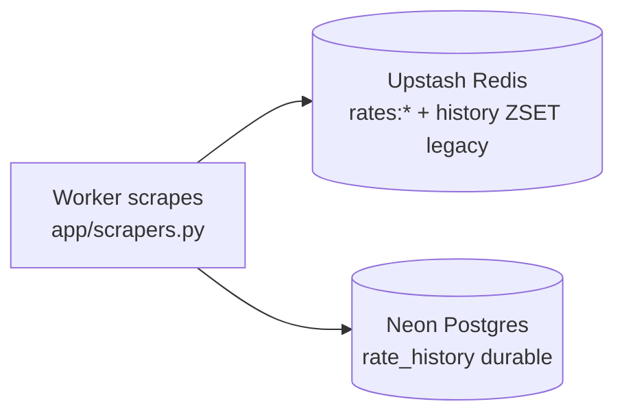
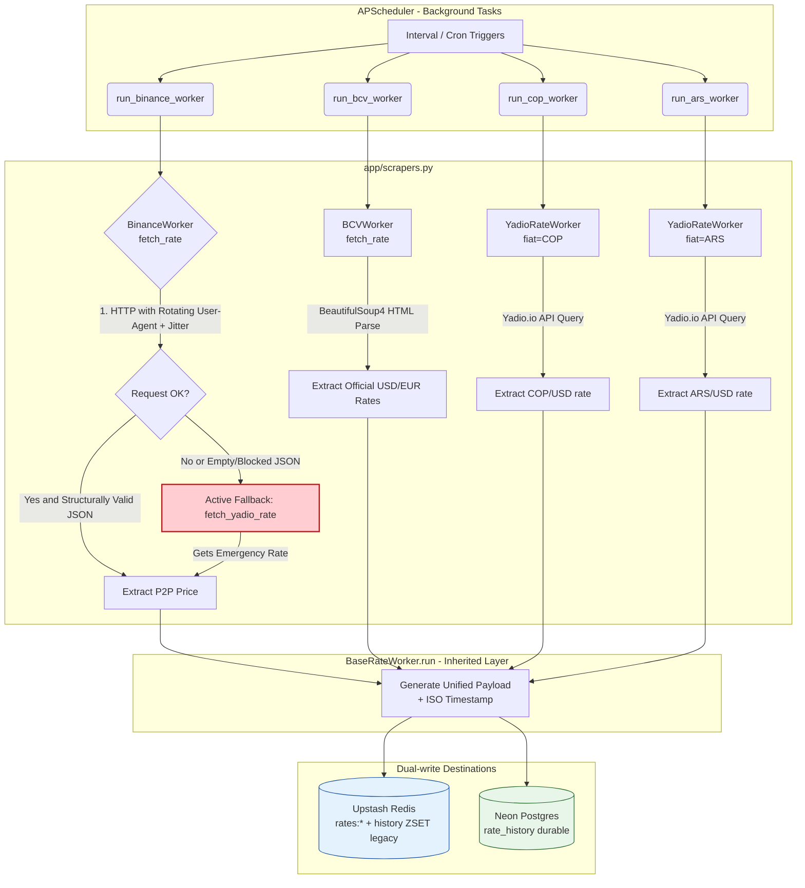
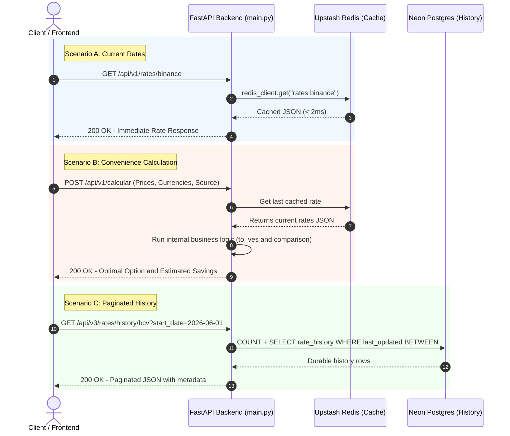
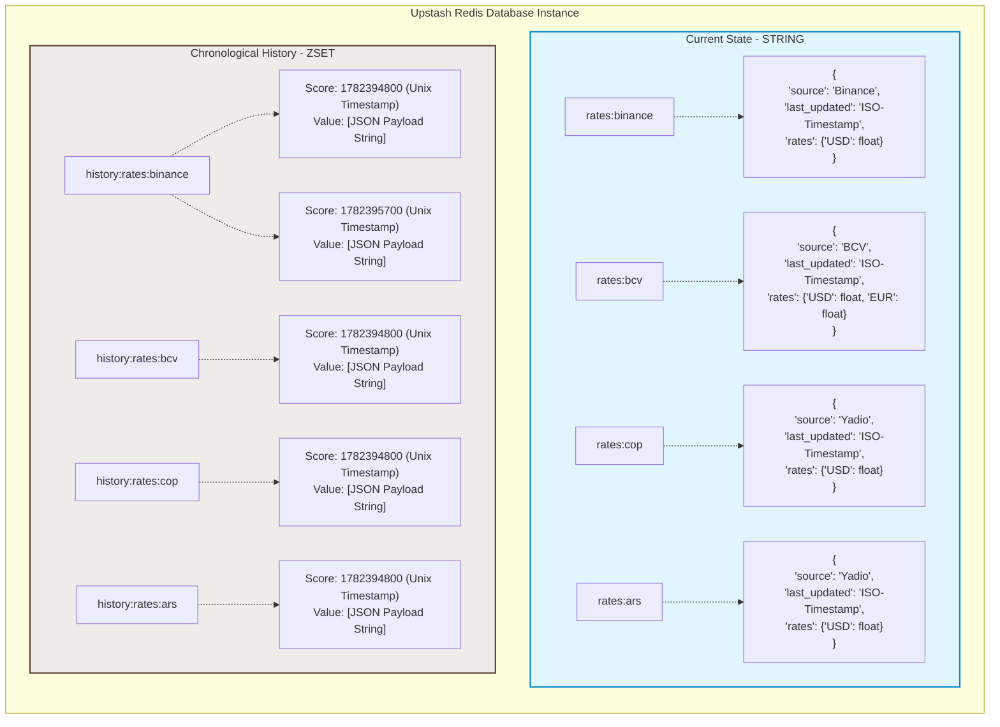

## CAMBIALY (BACKEND)

- [**API** Exchange Convenience Calculator (**VES**/**USD**/**EUR**)](#api-exchange-convenience-calculator-vesusdeur)
- [🏗️ System Architecture](#️-system-architecture)
   * [1. Resilient Extraction Infrastructure (Scrapers)](#1-resilient-extraction-infrastructure-scrapers)
   * [2. Persistence and Advanced Cache Layer (Upstash Redis + Neon Postgres)](#2-persistence-and-advanced-cache-layer-upstash-redis--neon-postgres)
   * [3. Background Lifecycle and Orchestration (FastAPI Lifespan)](#3-background-lifecycle-and-orchestration-fastapi-lifespan)
- [📁 Folder Structure](#-folder-structure)
   * [Quick overview of key files:](#quick-overview-of-key-files)
- [🛠️ Technologies Used](#️-technologies-used)
- [🔌 API Endpoints (Routes)](#-api-endpoints-routes)
   * [V1 — Legacy endpoints](#v1--legacy-endpoints)
   * [**1. System Status**](#1-system-status)
   * [**2. Get Day Rates (BCV / Binance)**](#2-get-day-rates-bcv--binance)
   * [**3. Get Chronological Rate History (V1)**](#3-get-chronological-rate-history-v1)
   * [**4. Calculate Payment Convenience**](#4-calculate-payment-convenience)
   * [**5. Scheduler Diagnostics**](#5-scheduler-diagnostics)
   * [V2 — Modern endpoints](#v2--modern-endpoints)
   * [**6. Rates by Asset Type**](#6-rates-by-asset-type--get-apiv2ratesasset)
   * [**7. Paginated History with Date Filter** — `GET /api/v3/rates/history/{category}`](#7-paginated-history-with-date-filter--get-apiv3rateshistorycategory)
- [🔒 Security and Middleware](#-security-and-middleware)
- [💻 Local Configuration](#-local-configuration)
   * [Traditional Method (Virtual Environment)](#traditional-method-virtual-environment)
   * [Docker Method (Recommended)](#docker-method-recommended)
- [📊 Architecture Diagrams](#-architecture-diagrams)
   * [Data State Diagram](#data-state-diagram)
   * [Data Flow Diagram (User Interaction)](#data-flow-diagram-user-interaction)
   * [Redis Data Model Diagram](#redis-data-model-diagram)
- [🤖 CI/CD (GitHub Actions)](#-cicd-github-actions)
- [Production Deployment Guide (Render + Upstash + Neon)](#production-deployment-guide-render--upstash--neon)
- [⚖️ Disclaimer](#️-disclaimer)
- [❓ FAQ: Technical Project Decisions](#-faq-technical-project-decisions)

<!-- TOC end -->

<!-- TOC --><a name="api-exchange-convenience-calculator-vesusdeur"></a>
## **API** Exchange Convenience Calculator (**VES**/**USD**/**EUR**)

This project is an automated, asynchronous, high-speed **REST API** designed to calculate in real time which payment method (cash foreign currency, euros, or bolivars at the official/parallel rate) is most convenient when making a purchase in Venezuela.

The goal is to solve an everyday problem: money lost to poorly calculated rounding or asymmetric exchange-rate gaps between businesses and current market rates.

---

<!-- TOC --><a name="️-system-architecture"></a>
## 🏗️ System Architecture

To support massive concurrent traffic in production without saturating external providers, avoiding network blocks and guaranteeing high availability, the backend does not query the source portals on every client request. Instead, it implements a decoupled, fault-tolerant ecosystem:

<!-- TOC --><a name="1-resilient-extraction-infrastructure-scrapers"></a>
### 1. Resilient Extraction Infrastructure (Scrapers)
Designed with the **Template Method Pattern** via the abstract class `BaseRateWorker`. It centralizes the execution flow, structural control of data schemas, ISO timestamp injection and persistence in an agnostic way.
* **`BinanceWorker` with Camouflage Enhancements:** Rotating **User-Agents** and random **dynamic Jitter** delays (1 to 8 seconds) before each request to mitigate automated IP tracking.
* **Failover Mechanism (Plan B):** On any critical anomaly in the Binance pipeline (timeouts, empty data payloads from bans, non-error but restrictive HTTP codes), the scraper activates a transparent bypass to the **Yadio.io** API as a high-availability contingency provider.
* **`YadioRateWorker` (COP / ARS):** Generic worker parameterized by fiat currency (`app/scrapers.py:209`). Queries `https://api.yadio.io/exchanges/{fiat}` every 15 minutes. Instantiated as `YadioRateWorker(fiat="COP", redis_key="rates:cop")` and `YadioRateWorker(fiat="ARS", redis_key="rates:ars")`.
* **`FrankfurterWorker` (COP / ARS):** Direct fiat/VES rate source via `https://api.frankfurter.dev/v2/rate/{fiat}/VES`, used by the COP and ARS jobs.

<!-- TOC --><a name="2-persistence-and-advanced-cache-layer-upstash-redis--neon-postgres"></a>
### 2. Persistence and Advanced Cache Layer (Upstash Redis + Neon Postgres)
All collected information lands on **two parallel, independent destinations**: Redis managed by Upstash (hot cache) and serverless Postgres from Neon (durable history). Dual data scheme:
* **Current State (`String`):** Stores a serialized JSON object under keys `rates:bcv`, `rates:binance`, `rates:cop` and `rates:ars` for immediate reads (< 2ms) by the calculator and rate endpoints.
* **Audit/History Log (`ZSET` / Sorted Set):** Chronological sequences under `history:rates:bcv`, `history:rates:binance`, `history:rates:cop` and `history:rates:ars`. The sort *score* is the event's Unix timestamp. **Legacy:** still written during the transition, but reads no longer go through it.
* **Durable History (`Postgres` / Neon):** Table `rate_history` (`category`, `source`, `last_updated` as Unix timestamp, `rates` JSONB) indexed on `(category, last_updated DESC)`. The v3 history endpoint reads exclusively from here.
* **Keep-Alive Strategy:** A dedicated scheduled task pings Upstash every 5 minutes, preventing connection degradation and neutralizing cold-start latency in Serverless/free services.

**Dual-write flow:** the worker scrapes once and writes **in parallel** to Upstash and Neon:



**Upstash does NOT feed Neon** — they are parallel targets, not a pipeline. Each survives the other's failure. Only exception: `scripts/backfill.py` (manual one-shot that migrates the ZSET history accumulated before the migration).

<!-- TOC --><a name="3-background-lifecycle-and-orchestration-fastapi-lifespan"></a>
### 3. Background Lifecycle and Orchestration (FastAPI Lifespan)
Background task automation is managed with **APScheduler** (`AsyncIOScheduler`), fully coupled to FastAPI's `lifespan` context manager.
* **Cache Hydration on Startup:** During early initialization (before receiving HTTP traffic), the API forces an initial synchronous run of all workers. This ensures production never answers with null/empty data on cold start.
* **Task Tolerance Policies:** Critical background routines use `misfire_grace_time=30` so server CPU timing skew does not discard scheduled runs or flood logs with warnings.

---

<!-- TOC --><a name="-folder-structure"></a>
## 📁 Folder Structure

```text
cambialy-backend/
├── app/
│   ├── __init__.py
│   ├── main.py              # API entry point and FastAPI Lifespan
│   ├── schemas.py           # Pydantic models (strict structural validation)
│   ├── services.py          # Business logic and contingency API integration
│   ├── database.py          # Upstash Redis connection + async Postgres engine
│   ├── models.py            # SQLAlchemy ORM (RateHistory)
│   ├── scrapers.py          # Abstract worker infrastructure (BCV / Binance / Yadio / Frankfurter)
│   ├── scheduler.py         # APScheduler job configuration
│   └── utils.py             # Helper functions and formatters
├── scripts/
│   └── backfill.py          # One-shot: Redis ZSET history → Postgres migration
├── tests/                   # Unit test suite (37 tests)
├── .github/workflows/ci.yml # CI: pytest + docker build on push/PR
├── .env                     # Secure environment variable configuration
├── docker-compose.yml       # Container infrastructure orchestration
├── Dockerfile               # Optimized Python environment packaging
├── requirements.txt         # Dependency tree
├── README.md                # Project documentation
└── readme-EN.md             # English documentation
```

<!-- TOC --><a name="quick-overview-of-key-files"></a>
### Quick overview of key files:

* **`app/main.py`**: Orchestrates the app lifecycle (`lifespan`), exposes interactive docs at `/docs`, globally catches exceptions and defines the public routes (v1/v2/v3).
* **`app/scrapers.py`**: Modularized web extraction logic. Implements inheritance and async threads to isolate HTML parsing (BeautifulSoup4) and safe JSON queries (HTTPX).
* **`app/scheduler.py`**: Centralizes automatic interval configuration:
* `job_ping_redis`: Strict 5-minute interval.
* `job_binance_scraper`: 15-minute interval.
* `job_bcv_scraper`: Parametrized `cron` expression Monday-Friday, 11:00-18:00, at minutes 0 and 30 of each hour.
* `job_cop_scraper`: 15-minute interval — Colombian Peso worker.
* `job_ars_scraper`: 15-minute interval — Argentine Peso worker.
* **`app/database.py`**: Upstash Redis connection (`redis-py` with SSL) plus async SQLAlchemy engine/session for Postgres (`AsyncSessionLocal`), with `MockRedis` fallback for local development.
* **`app/models.py`**: `RateHistory` ORM model — `category`, `source`, `last_updated` (Unix float), `rates` (JSONB on Postgres / JSON on SQLite).
* **`app/utils.py`**: Helpers — `datetime_to_unix()` converts ISO8601 datetimes to Unix timestamps.
* **`app/schemas.py`**: Pydantic models — `CalculationRequest`, `CalculationResponse` and `RateResponseDTO` (standardized rate response DTO: `source`, `target_currency`, `rate_value`, `last_updated`).
* **`tests/`**: 37 unit tests (`test_main.py`, `test_frankfurter_worker.py`, `test_rate_limit.py`, `test_services.py`, ...). History tests run against SQLite in-memory simulating Postgres; Redis is mocked.

---

<!-- TOC --><a name="️-technologies-used"></a>
## 🛠️ Technologies Used

* **Base Framework:** `FastAPI` 0.100+ (async, ASGI-based, OpenAPI/Swagger autogeneration).
* **Task Management:** `APScheduler` (Advanced Python Scheduler).
* **HTTP Client:** `HTTPX` (native async concurrency).
* **HTML Processing:** `BeautifulSoup4` + `lxml`.
* **Cache Engine:** `Redis` (direct SSL connectors to Upstash).
* **Durable Storage:** `PostgreSQL` via Neon (serverless) + `SQLAlchemy` 2.0 async + `psycopg`.
* **DevOps Ecosystem:** `Docker` & `Docker Compose` for container standardization, `GitHub Actions` for CI.

---

<!-- TOC --><a name="-api-endpoints-routes"></a>
## 🔌 API Endpoints (Routes)

### V1 — Legacy endpoints

<!-- TOC --><a name="1-system-status"></a>
#### **1. System Status**

* **Route:** `GET /`
* **Description:** Welcome endpoint and immediate visual check. Returns quick links to the docs.
* **Route:** `GET /health`
* **Description:** Health check for cloud orchestrators (Render/Railway/AWS). Confirms service operational health.

<!-- TOC --><a name="2-get-day-rates-bcv--binance"></a>
#### **2. Get Day Rates (BCV / Binance)**

* **Routes:** `GET /api/v1/rates/bcv` | `GET /api/v1/rates/binance`
* **Description:** Retrieves current structured rates in milliseconds directly from Redis RAM.
* **Sample response (Binance JSON):**

```json
{
  "source": "Binance",
  "last_updated": "2026-06-09T13:35:00.123456Z",
  "rates": {
    "USD": 45.20
  }
}
```

<!-- TOC --><a name="3-get-chronological-rate-history-v1"></a>
#### **3. Get Chronological Rate History (V1)**

* **Route:** `GET /api/v1/rates/history/{category}`
* **Query parameters:**
* `category` (Path): `bcv` or `binance` (required).
* `limit` (Query): Integer between 1 and 100. Controls response size (default: 20).
* **Description:** Reads the legacy Redis ZSET to recover the last N analytical snapshots, ordered newest to oldest.

<!-- TOC --><a name="4-calculate-payment-convenience"></a>
#### **4. Calculate Payment Convenience**

* **Route:** `POST /api/v1/calcular`
* **Description:** Receives two store payment options, evaluates input currencies (`USD`, `VES`, `EUR`, `COP`, `ARS`), injects the stored rate of the preferred source and computes the economically optimal option and real savings.
* **Request body (`CalculationRequest`):**

```json
{
  "price_a": 20.00,
  "type_a": "USD",
  "price_b": 920.00,
  "type_b": "VES",
  "target_currency": "USD",
  "preferred_source": "binance"
}
```

<!-- TOC --><a name="5-scheduler-diagnostics"></a>
#### **5. Scheduler Diagnostics**

* **Route:** `GET /debug/scheduler`
* **Description:** Secure internal endpoint to audit the async scheduler state, showing active task IDs, function references and the exact next scheduled execution time.

---

### V2 — Modern endpoints

All V2 endpoints return standardized responses via `RateResponseDTO` (`{source, target_currency, rate_value, last_updated}`). Mounted under `/api/v2/rates/`.

<!-- TOC --><a name="6-rates-by-asset-type--get-apiv2ratesasset"></a>
#### **6. Rates by Asset Type** — `GET /api/v2/rates/{asset}`

| Asset | Route | Source | Redis key |
|---|---|---|---|
| USD | `/api/v2/rates/usd` | BCV | `rates:bcv` |
| EUR | `/api/v2/rates/eur` | BCV | `rates:bcv` |
| USDT | `/api/v2/rates/usdt` | Binance P2P | `rates:binance` |
| COP | `/api/v2/rates/cop` | Yadio/Frankfurter | `rates:cop` |
| ARS | `/api/v2/rates/ars` | Yadio/Frankfurter | `rates:ars` |

**Query parameters:**

| Parameter | Type | Required | Description |
|---|---|---|---|
| `date` | `datetime` (ISO8601) | No | Historical query date/time. Ex: `2026-06-15T14:30:00Z` |

* **Without `?date=`:** Returns `RateResponseDTO` with the most recent rate.
* **With `?date=`:** Searches the history for the record with timestamp closest `<=` to the given one and returns:

```json
{
  "currency": "USDT",
  "rate": 46.50,
  "timestamp": "2026-06-15T14:30:00Z"
}
```

<!-- TOC --><a name="7-paginated-history-with-date-filter--get-apiv3rateshistorycategory"></a>
#### **7. Paginated History with Date Filter** — `GET /api/v3/rates/history/{category}`

**Route parameters:**

| Parameter | Type | Values |
|---|---|---|
| `category` | `string` (path) | `bcv`, `binance`, `cop`, `ars` |

**Query parameters:**

| Parameter | Type | Default | Description |
|---|---|---|---|
| `page` | `int` | 1 | Page number (starts at 1) |
| `size` | `int` | 50 | Records per page (max 100) |
| `cursor` | `string` | `null` | Pagination cursor (ISO8601 or Unix timestamp) for infinite scroll |
| `date` | `date` (YYYY-MM-DD) | `null` | Single date → **ALL** rates of that full day. Mutually exclusive with `start_date`/`end_date`. Ex: `2026-06-01` |
| `start_date` | `date` (YYYY-MM-DD) | `null` | Range start. Alone → **ALL** rates of that full day. Ex: `2026-06-01` |
| `end_date` | `date` (YYYY-MM-DD) | `null` | Range end. With `start_date` forms an inclusive range of full days. Ex: `2026-06-03` |

**Response:**

```json
{
  "category": "binance",
  "page": 1,
  "size": 50,
  "total_records": 1200,
  "history": [
    {
      "source": "Binance",
      "last_updated": "2026-06-15T14:30:00.123456Z",
      "rates": { "USD": 46.50 }
    }
  ]
}
```

**Date filter behavior:**
* History is read from **Postgres (Neon)** — table `rate_history` (`category`, `source`, `last_updated` Unix, `rates` JSONB), index `(category, last_updated DESC)`. Redis serves only the current rate.
* No date params → total count with `COUNT`, pagination with `ORDER BY last_updated DESC + OFFSET/LIMIT`.
* `date` or `start_date` alone → **full day**: `00:00:00` to `23:59:59` (`WHERE last_updated BETWEEN`). Ex: `?date=2026-06-01` or `?start_date=2026-06-01` returns ALL rates of June 1st regardless of hour.
* `start_date` + `end_date` → **inclusive** full-day range: `start_date` from `00:00:00` and `end_date` until `23:59:59`. Ex: `?start_date=2026-06-01&end_date=2026-06-03` returns rates of June 1, 2 and 3.
* `date` mixed with `start_date`/`end_date` → `400 Bad Request`.
* `end_date < start_date` → `400 Bad Request`.
* Invalid format → `422 Unprocessable Entity`. Full ISO8601 is tolerated (`2026-06-01T00:00:00Z` truncates to `2026-06-01`).
* No data in range → empty `history`, `total_records: 0`.
* `DATABASE_URL` not configured → `503 Service Unavailable`.

> `/api/v2/rates/history/{category}` remains as a **deprecated alias** (same logic, marked deprecated in Swagger) for backwards compatibility.

---

<!-- TOC --><a name="-security-and-middleware"></a>
## 🔒 Security and Middleware

| Component | Description |
|---|---|
| **CORS** | Configurable origins via `ALLOWED_ORIGINS` (env). Defaults to `localhost:5173` in development, restrictive in production. |
| **Rate Limiting** | slowapi — 10 requests/minute per IP. Exceeding → `429 Too Many Requests`. |
| **HTTP Security** | `X-Content-Type-Options: nosniff`, `X-Frame-Options: DENY`, `Strict-Transport-Security: max-age=31536000` |
| **Error Handling** | Uncaught exceptions → generic `500`. HTTP errors → `{error: "safe message"}` without leaking internal details. |
| **Authentication** | `/debug/scheduler` protected with HTTP Basic Auth (`ADMIN_USERNAME` / `ADMIN_PASSWORD`). |

---

<!-- TOC --><a name="-local-configuration"></a>
## 💻 Local Configuration

<!-- TOC --><a name="traditional-method-virtual-environment"></a>
### Traditional Method (Virtual Environment)

1. **Clone the repository:**
```shell
git clone https://github.com/your-org/cambialy-backend.git
cd cambialy-backend
```

2. **Initialize Virtual Environment and Install Dependencies:**
```shell
python -m venv venv
# Activate on Windows: .\venv\Scripts\activate | On Linux: source venv/bin/activate
pip install -r requirements.txt
```

3. **Run in Development Mode (Live Reload):**
```shell
uvicorn app.main:app --reload
```

<!-- TOC --><a name="docker-method-recommended"></a>
### Docker Method (Recommended)

Standardizes dependencies without requiring Python setup on the host:

```shell
docker-compose up --build
```

*To stop containers and clean up resources:* `docker-compose down`

> **Local without external services:** with `APP_ENV=development` and no `DATABASE_URL`, the API uses `MockRedis` (in-memory) and history returns `503` — perfect for logic tests without touching Upstash/Neon.

---

<!-- TOC --><a name="-architecture-diagrams"></a>
## 📊 Architecture Diagrams

<!-- TOC --><a name="data-state-diagram"></a>
### Data State Diagram

Illustrates the continuous, independent lifecycle of rate data from external extraction to hot structuring:



<!-- TOC --><a name="data-flow-diagram-user-interaction"></a>
### Data Flow Diagram (User Interaction)

Shows how the API reacts immediately, abstracting client requests from external load times:



<!-- TOC --><a name="redis-data-model-diagram"></a>
### Redis Data Model Diagram

Shows key-value String structures coexisting with chronologically indexed Sorted Sets:



---

<!-- TOC --><a name="-cicd-github-actions"></a>
## 🤖 CI/CD (GitHub Actions)

Workflow `.github/workflows/ci.yml` — runs on every push to `main`/`dev` and on every PR:

| Job | What it does | Result |
|---|---|---|
| `tests` | `uv` + `pip install -r requirements.txt` + `pytest` (37 tests) | ✅/❌ |
| `docker-build` | `docker build .` validates the Dockerfile compiles | ✅/❌ |

No secrets required (tests run with `MockRedis` + in-memory SQLite). Check status in the repository's **Actions** tab. The scraping cron does NOT move to GitHub Actions (minute cost and per-run latency — see FAQ).

---

<!-- TOC --><a name="production-deployment-guide-render--upstash--neon"></a>
## Production Deployment Guide (Render + Upstash + Neon)

1. **Upstash Redis:** Register at [upstash.com](https://upstash.com), create a free Redis database. Make sure to disable "Auto Upgrade" to shield the free plan from automatic charges.
2. **Neon Postgres:** Create a project at [neon.tech](https://neon.tech), copy the **pooled** connection string (`-pooler` host).
3. **Render configuration:** Link the GitHub repository. Select deployment via the `Dockerfile`.
4. **Key environment variables:**
* `APP_ENV=production`
* `UPSTASH_REDIS_REST_URL=your_redis_connection_url`
* `UPSTASH_REDIS_REST_TOKEN=your_secret_auth_token`
* `DATABASE_URL=your_neon_postgres_connection_string` (durable history — use the **pooled** Neon endpoint)

5. **Create the history table** (one-time, via Neon SQL editor):

```sql
CREATE TABLE IF NOT EXISTS rate_history (
  id BIGSERIAL PRIMARY KEY,
  category TEXT NOT NULL,
  source TEXT NOT NULL,
  last_updated DOUBLE PRECISION NOT NULL,
  rates JSONB NOT NULL
);
CREATE INDEX IF NOT EXISTS idx_history_cat_ts ON rate_history (category, last_updated DESC);
```

6. **Migrate existing history** (one-time, against the real Redis): `uv run python scripts/backfill.py`
7. **Handling Suspension State (Cold Starts):** Render's free plan freezes the HTTP instance after 15 minutes of absolute inactivity. Link `/health` to an external availability monitor (like *cron-job.org*) pinging every 10 minutes.

---

<!-- TOC --><a name="️-disclaimer"></a>
## ⚖️ Disclaimer

The data, exchange rates and any information provided by this project and its API are **strictly informational** and obtained from third-party public sources (BCV, Binance, Yadio.io).

**This project does NOT constitute financial advice, investment recommendation, nor does it guarantee the accuracy, completeness or timeliness of real-time data.** Use of the information is at the sole responsibility of the user.

This project's maintenance is independent and is not affiliated with, endorsed by, or sponsored by any of the entities mentioned as data sources.

---

<!-- TOC --><a name="-faq-technical-project-decisions"></a>
## ❓ FAQ: Technical Project Decisions

<!-- TOC --><a name="1-why-is-a-background-scheme-used-if-this-is-a-calculator"></a>
### 1. Why is a background scheme used if this is a calculator?
Looking up exchange rates from portals like BCV or P2P platforms at the exact moment the user presses "Calculate" would cause a poor experience (high network latency, service outages if the source is down, and imminent risk of blocks from repetitive bot behavior). By decoupling scraping through automatic async tasks that feed an in-memory database (Redis), the calculator processes responses instantly (< 2ms), ensuring absolute resilience against external network anomalies.

<!-- TOC --><a name="2-why-use-sorted-sets-zset-instead-of-a-relational-database-postgresql-for-history"></a>
### 2. Why use Sorted Sets (ZSET) instead of a relational database (PostgreSQL) for history?
For the original scope, a relational DB added unnecessary infrastructure overhead (concurrent connection management, migrations, disk latency). **Sorted Sets** natively order elements by numeric *score*. Using the Unix timestamp as score gives:
* **O(log(N) + M) complexity** for inversely ordered range retrieval (`ZREVRANGEBYSCORE`), ideal for chart pagination.
* **Automatic deduplication:** if a network skew runs the same process twice in the same second with the same payload, Redis does not duplicate the row — it updates the score, keeping the database clean.

> **Update:** History migrated to **Postgres (Neon)** — ZSETs are still written during the transition (dual-write), but the v3 endpoint reads from the `rate_history` table (durable, indexed, no RAM limit). Redis remains the current-rate cache. (`/api/v2/rates/history/` remains as a deprecated alias.)

<!-- TOC --><a name="3-what-happens-if-both-binance-and-the-contingency-service-yadio-fail-at-the-same-time"></a>
### 3. What happens if both Binance and the contingency service (Yadio) fail at the same time?
The system is designed under **graceful degradation**. If `BinanceWorker` fails, it switches to Yadio; if Yadio also suffers an extreme outage, the exception is caught and logged by the `BaseRateWorker` core without altering Redis state.
* **Result:** The API keeps serving the last known valid rate (*Stale-While-Revalidate*) stored under `rates:binance`. The end user gets a successful response based on the last clean market snapshot, while the team receives alerts in the logs.

<!-- TOC --><a name="4-why-couple-the-scheduler-to-fastapi-lifespan-instead-of-an-independent-process-like-celery"></a>
### 4. Why couple the Scheduler to FastAPI Lifespan instead of an independent process like Celery?
For microservice platforms or monolithic containerized architectures (like Render's or Railway's economical plans), spawning a Celery worker, a queue manager (RabbitMQ/separate Redis) and a task monitor (Flower) triples costs and operational complexity.
Integrating `APScheduler` directly into the `lifespan` `asynccontextmanager` lets background tasks share the same event loop as the FastAPI process. This optimizes container RAM usage and exposes direct telemetry (like `/debug/scheduler`).

<!-- TOC --><a name="5-how-is-data-poisoning-or-corrupt-payload-insertion-into-redis-mitigated"></a>
### 5. How is data poisoning or corrupt payload insertion into Redis mitigated?
Strict two-layer structural validation:
1. **Scraping validation:** Before JSON serialization, workers verify the expected keys physically exist in the API responses (`data`, `adv`, `price`). If the structure mutates or a field is missing, the immediate `except` block fires instead of persisting corrupt or null data.
2. **Output type validation:** `fetch_rate()` responses are forced to a strict contract of dictionaries with floats rounded to two decimals, guaranteeing absolute mathematical consistency for the calculator.

<!-- TOC --><a name="6-why-is-last_updated-stored-as-a-unix-float-timestamp-instead-of-timestamptz"></a>
### 6. Why is `last_updated` stored as a Unix float timestamp instead of `TIMESTAMPTZ`?
Deliberate decision for 3 reasons:

1. **Compatibility with the existing ZSET score:** Workers already stored `current_time.timestamp()` as the Sorted Set score (`app/scrapers.py`). Storing the column in the same format lets the **backfill** (`scripts/backfill.py`) migrate Redis data to Postgres **without conversion** — the score goes straight to `last_updated`. With `TIMESTAMPTZ`, every row would have required datetime conversion (timezone error risk).

2. **Cross-database portability for tests:** Tests run against **SQLite in-memory** (`tests/conftest.py`) while production uses **Postgres**. `TIMESTAMPTZ` behaves differently in each (SQLite stores strings, Postgres tz-aware binary), making range comparisons engine-dependent. A **float compares numerically identically in any database**: `last_updated >= min AND <= max` is pure math.

3. **Zero timezone ambiguity:** The Unix epoch is absolute UTC — no "UTC or local?" doubt at storage time. Timezone only matters at **presentation**, where the `_rate_history_to_payload` helper (`app/main.py`) converts the float to ISO-8601 with a `Z` suffix.

**Trade-offs assumed:**
* Less readability when inspecting the DB (`1780308000.0` instead of `2026-06-01 00:00:00`).
* SQL queries with date functions require `to_timestamp(last_updated)` (natively supported by Postgres, so day/month aggregates remain possible).

If heavy `date_trunc` SQL is ever needed, the column can be migrated to `TIMESTAMPTZ` with an `ALTER` + one-shot conversion.